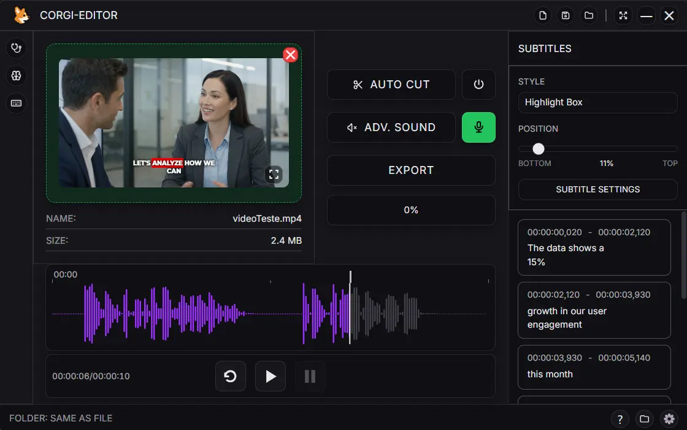
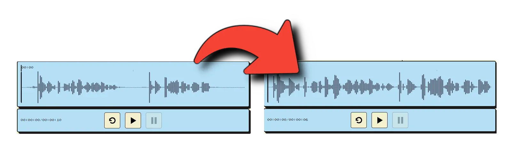
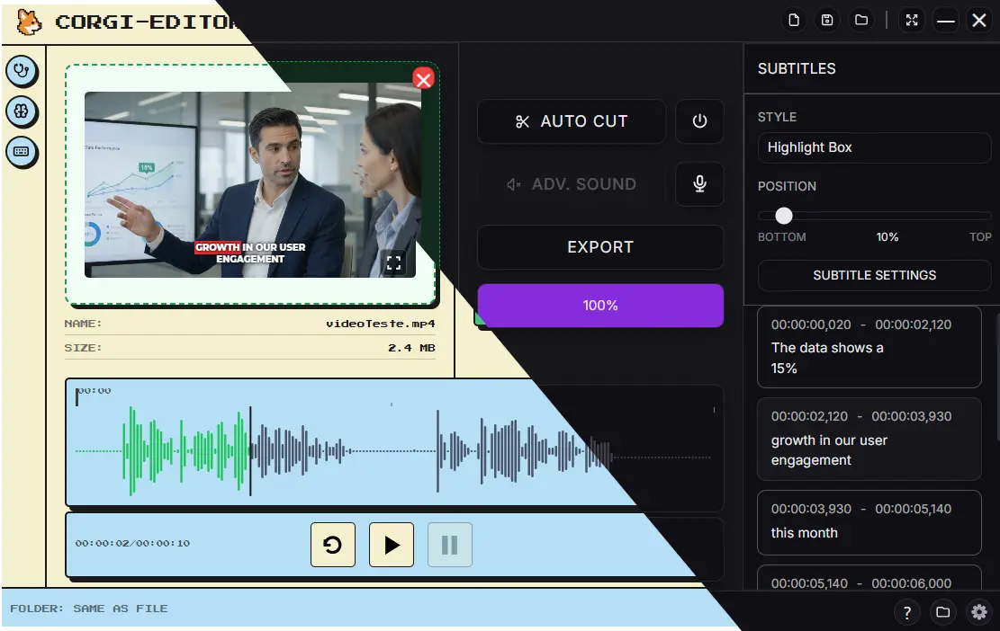

# CORGI-EDITOR

Automatic video/audio editing with AI-powered subtitles.

  

<!-- Version is defined in: src/global_config/version.js -->
<!-- Update package.json version to match -->

---

## What is CORGI-EDITOR?

CORGI-EDITOR is a desktop application for automatic video and audio editing. It removes silences, generates word-level subtitles using AI (whisper.cpp), and exports with burned-in subtitles in multiple styles.

### Key Features

---
- **Auto-silence removal** — Automatically cuts silences from video/audio using auto-editor (Settings > Output)

- **AI subtitle generation** — Word-level transcription via whisper.cpp with CUDA GPU support
- **7 subtitle styles** — Hormozi, MrBeast, Karaoke, Headline, Simple, Highlight Box, Popline
- **26 bundled fonts** — Montserrat, Bebas Neue, Bangers, Lilita One, Komika Axis, IBM Plex Sans, Anton, Archivo Black, Poppins, Rubik, Roboto, Oswald, Inter, Fira Sans Condensed, Luckiest Guy, Titan One, Open Sans, Lato, Raleway, Nunito, Work Sans, Playfair Display, Lobster, Pacifico, Caveat, Permanent Marker (all free for commercial use — see `src/global_config/fonts/LICENSES.md`)
- **Favorite fonts** — Star fonts in the per-style picker; favorites sort first

  

- **Instant cut option** — Cut right away when AUTO CUT is toggled, or only at export time
- **Sound treatment** — Denoise, filters, EQ, loudness and compression with system and custom presets
- **Projects** — NEW / SAVE PROJECT / OPEN PROJECT, with a list of the 5 most recent
- **Live preview** — Real-time subtitle overlay with word-by-word animation
- **Per-style configuration** — Custom fonts, colors, font size, words per line per style
- **Smart subtitle mode** — Automatic sentence-break detection at punctuation
- **Auto line wrap** — Breaks the line when the text doesn't fit, keeping the same group (optional)
- **Output resolution** — Original, Landscape (16:9) 1080p/720p or Portrait (9:16), letterbox keeps the source aspect ratio
- **Green screen mode** — Generate subtitle videos with a green background for chroma key to export to your favorite video editor.
- **Multiple formats** — MP3, WAV, FLAC, OGG, AAC, M4A, MP4, MKV, MOV, WEBM, AVI
- **Bilingual UI** — English and Portuguese (Settings > Sistema)
- **Two Themes** — Select between _Modern_ or _Retro_ style.

  

## System Requirements

CORGI-EDITOR itself is lightweight — the heavy parts are whisper transcription and FFmpeg encoding. A dedicated GPU is optional (CUDA is downloaded separately); without one, everything still runs on CPU.

| Tier | Features that run comfortably | Machine specs |
|------|-------------------------------|---------------|
| **Minimum** | Silence cutting with auto-editor, export via FFmpeg, live preview and subtitles with the bundled **tiny** model (short files) | Windows 10/11 (64-bit) · dual-core CPU (Intel Core i3 / AMD Ryzen 3) · 4 GB RAM · integrated graphics · ~2 GB free disk |
| **Recommended** | Everything above plus **base / small / medium** models, GPU subtitles (CUDA), 1080p exports with burned-in subtitles | Windows 10/11 (64-bit) · quad-core CPU (Intel Core i5 10th gen or newer / AMD Ryzen 5) · 8–16 GB RAM · NVIDIA GPU with 6–8 GB VRAM (GTX 1060 / RTX 2060 or newer) · SSD with ≥5 GB free |
| **Maximum** *(optional)* | **Large-v3** subtitles, 4K exports, long files and large batches without waiting | Windows 10/11 (64-bit) · 8-core CPU (Intel Core i7 / AMD Ryzen 7) · 32 GB RAM · NVIDIA RTX 3060 12 GB or newer (large-v3 needs ~10 GB VRAM) · NVMe SSD with ≥10 GB free |

> VRAM figures match the [Whisper Models](#whisper-models) table below. Any NVIDIA GPU supports the **DOWNLOAD GPU** download; the tier only defines how large a model you can run comfortably.

---

## Installation

### Download

Download the latest installer from [GitHub Releases](https://github.com/LuizFelipeRDev/corgi-editor/releases).

### Steps

1. Run the `.exe` installer (NSIS — allows custom install directory)
2. Launch CORGI-EDITOR
3. (Optional) Go to **Settings > General** and click **BAIXAR GPU** for faster subtitle generation
4. (Optional) Download larger whisper models (base, small, medium, large-v3) from Settings

### First Launch

On first run, bundled binaries and fonts are copied to `%APPDATA%/corgi-editor/`:
- `bin/auto-editor.exe` — silence removal
- `bin/ffmpeg.exe`, `bin/ffplay.exe`, `bin/ffprobe.exe` — media processing
- `bin/whisper/whisper-cli.exe` (+ DLLs) — whisper.cpp CPU build, so subtitles work with no download
- `bin/whisper/ggml-tiny.bin` — default whisper model (75 MB)
- `fonts/` — the bundled fonts, mirrored for burned-in subtitles

---

## How to Use

### 1. Import Media

Drag and drop a video or audio file onto the application window, or click to browse.

### 2. Configure Settings

Click the gear icon to open Settings:

| Tab | Options |
|-----|---------|
| **Sistema** | Language (English / Português) |
| **Geral** | Output folder, GPU download, whisper model |
| **Saida** | Output format, resolution (Original / Landscape 1080p / Landscape 720p / Portrait), subtitle language, instant cut |
| **Legendas** | Enable subtitles, position, words per line & lines, persistence, smart mode, auto line wrap, burn-in, green screen, horizontal margin |

### 3. Adjust Audio Processing

The Controls panel holds the AUTO CUT row, the sound row and the export button:
- **AUTO CUT** — the scissors button opens the cut settings: **Min volume** (dB, default: -30), **Margin before/after** (seconds, default: 0.5) and **Smoothness** (seconds, default: 0.2); the power button toggles the cut on/off
- **ADV. SOUND** — opens the sound treatment chain (denoise, filters, EQ, loudness, compressor, speed, echo) with system presets and your own; the microphone button arms it for preview and export

### 4. Generate Subtitles

1. Enable subtitles in Settings > Legendas
2. Choose a subtitle style from the Subtitles panel
3. Click **GERAR LEGENDAS** — whisper.cpp transcribes with word-level timestamps
4. Preview the subtitles on the video in real-time

### 5. Export

Click **EXPORTAR** to process the file:
1. auto-editor removes silences (when AUTO CUT is on)
2. Subtitles are remapped to the edited timeline
3. FFmpeg encodes the final output in the format chosen in Settings (audio formats export audio only)

---

## Subtitle Styles

| Style | Font | Animation | Best For |
|-------|------|-----------|----------|
| **Hormozi** | Montserrat | Highlight (cyan) | Business & motivation |
| **MrBeast** | Komika Axis | Bounce (gold) | Gaming & entertainment |
| **Karaoke** | Montserrat | Cumulative fill | Music & sing-alongs |
| **Headline** | Bebas Neue | Scale | Professional & clean |
| **Simple** | Montserrat | Static | Podcast & conversation |
| **Highlight Box** | Montserrat | Background box on active word (purple) | Viral & trending content |
| **Popline** | Montserrat | Thin purple band + pop on active word | Pop & viral content |

### Per-Style Configuration

Click the gear icon next to any style to customize:
- **Font** — 26 bundled fonts: Montserrat, Bebas Neue, Bangers, Lilita One, Komika Axis, IBM Plex Sans, Anton, Archivo Black, Poppins, Rubik, Roboto, Oswald, Inter, Fira Sans Condensed, Luckiest Guy, Titan One, Open Sans, Lato, Raleway, Nunito, Work Sans, Playfair Display, Lobster, Pacifico, Caveat, Permanent Marker (all free for commercial use — see `src/global_config/fonts/LICENSES.md`) — star a font to make it a favorite (favorites sort first)
- **Font Size** — 50-200 range
- **Colors** — Primary (text) and Highlight (active word)
- **Words per Line** — 3-6 words
- **Lines Count** — 1-3 lines

---

## Smart Subtitle Mode

When enabled in Settings > Legendas:
- Detects sentence-ending punctuation (`.`, `!`, `?`)
- Removes trailing periods from displayed text
- `!` and `?` remain visible
- Automatically breaks subtitle blocks at sentence boundaries

**Example:**
- Input: `"Oi ricardo, voce conhece Samantha? Ela"`
- Without smart: One block with all 6 words
- With smart: `"Oi ricardo, voce conhece Samantha?"` → `"Ela é minha amiga da escola"`

---

## Subtitle Persistence

Controls how long subtitles remain visible during silence gaps — a slider from **0.5s to 3.0s** in 0.1s steps (default: **1.0s**).

| Value | Behavior |
|-------|----------|
| **0.5s** | Minimal persistence — subtitles disappear quickly |
| **1.0s** (default) | Standard — subtitles persist 1 second between phrases |
| **3.0s** | Maximum — subtitles persist through long pauses |

---

## GPU Support (CUDA)

GPU acceleration is available for NVIDIA GPUs:

1. Go to **Settings > General**
2. Click **BAIXAR GPU (NVIDIA)** (~422 MB download)
3. The app downloads `whisper-cuda.zip` from GitHub Releases
4. Files are extracted to `%APPDATA%/corgi-editor/bin/whisper/`

### Downloaded Files

| File | Purpose |
|------|---------|
| `whisper-cli.exe` | whisper.cpp CLI with CUDA support |
| `ggml-cuda.dll` | CUDA inference backend |
| `cublas64_12.dll` | NVIDIA cuBLAS library |

---

## Whisper Models

| Model | Size | VRAM | Speed | Quality |
|-------|------|------|-------|---------|
| **Tiny** | 75 MB | ~1 GB | Fast | Basic |
| **Base** | 142 MB | ~1 GB | Fast | Better |
| **Small** | 466 MB | ~2 GB | Medium | Good balance |
| **Medium** | 1.5 GB | ~5 GB | Slow | High quality |
| **Large v3** | 2.9 GB | ~10 GB | Slowest | Best quality |

Only `ggml-tiny.bin` is bundled. Download others from Settings > General.

---

## Configuration

Settings are saved automatically in `%APPDATA%/corgi-editor/config.ini`.

---

## Credits

CORGI-EDITOR is built on top of these open-source projects — full credit to their authors and contributors.

### Core tools (bundled with the app)

| Project | Repository | Used for |
|---------|-----------|----------|
| **auto-editor** | [github.com/WyattBlue/auto-editor](https://github.com/WyattBlue/auto-editor) | Silence detection and automatic cutting |
| **FFmpeg** | [github.com/FFmpeg/FFmpeg](https://github.com/FFmpeg/FFmpeg) | Encoding, format conversion and burned-in subtitles |
| **whisper.cpp** | [github.com/ggml-org/whisper.cpp](https://github.com/ggml-org/whisper.cpp) | Word-level speech-to-text for AI subtitles (CPU/CUDA) |

### App stack

| Project | Repository | Used for |
|---------|-----------|----------|
| **Electron** | [github.com/electron/electron](https://github.com/electron/electron) | Desktop runtime |
| **React** | [github.com/facebook/react](https://github.com/facebook/react) | UI framework |
| **Vite** | [github.com/vitejs/vite](https://github.com/vitejs/vite) | Build tool and dev server |
| **Tailwind CSS** | [github.com/tailwindlabs/tailwindcss](https://github.com/tailwindlabs/tailwindcss) | Styling |
| **WaveSurfer.js** | [github.com/katspaugh/wavesurfer.js](https://github.com/katspaugh/wavesurfer.js) | Audio waveform visualization |
| **Tabler Icons** | [github.com/tabler/tabler-icons](https://github.com/tabler/tabler-icons) | Interface icons |
| **electron-builder** | [github.com/electron-userland/electron-builder](https://github.com/electron-userland/electron-builder) | Windows (NSIS) installer |

### Fonts

The 26 bundled fonts come from [Google Fonts](https://fonts.google.com/), all free for commercial use — see `src/global_config/fonts/LICENSES.md` for the full list and their licenses.

---

## License

MIT License

---

---

# Português

## O que é o CORGI-EDITOR?

CORGI-EDITOR é uma aplicação desktop para edição automática de vídeo e áudio. Ele remove silêncios, gera legendas com nível de palavra usando IA (whisper.cpp) e exporta com legendas queimadas em múltiplos estilos.

### Funcionalidades Principais

- **Remoção automática de silêncios** — Corta silêncios automaticamente usando auto-editor (Configurações > Saída)
- **Corte imediato** — Corta na hora ao ligar o AUTO CUT, ou só na exportação
- **Tratamento de som** — Redução de ruído, filtros, EQ, loudness e compressão com presets do sistema e personalizados
- **Geração de legendas com IA** — Transcrição nível de palavra via whisper.cpp com suporte CUDA GPU
- **Projetos** — NOVO / SALVAR PROJETO / ABRIR PROJETO, com lista dos 5 mais recentes
- **7 estilos de legenda** — Hormozi, MrBeast, Karaoke, Headline, Simple, Highlight Box, Popline
- **Pré-visualização em tempo real** — Overlay de legendas com animação palavra por palavra
- **Configuração por estilo** — Fontes, cores, tamanho, palavras por linha personalizáveis
- **Fontes favoritas** — Marque fontes com estrela no seletor por estilo; favoritas aparecem primeiro
- **26 fontes embutidas** — Montserrat, Bebas Neue, Bangers, Lilita One, Komika Axis, IBM Plex Sans, Anton, Archivo Black, Poppins, Rubik, Roboto, Oswald, Inter, Fira Sans Condensed, Luckiest Guy, Titan One, Open Sans, Lato, Raleway, Nunito, Work Sans, Playfair Display, Lobster, Pacifico, Caveat e Permanent Marker (todas gratuitas para uso comercial — veja `src/global_config/fonts/LICENSES.md`)
- **Modo legenda inteligente** — Detecção automática de quebra de frase em pontuação
- **Quebra automática de linha** — Quando o texto não cabe na largura, quebra a linha e mantém o mesmo grupo (opcional)
- **Resolução de saída** — Original, Paisagem (16:9) 1080p/720p ou Retrato (9:16), com letterbox que preserva a proporção da fonte
- **Modo tela verde** — Gera vídeos com legendas e fundo verde para chroma key, prontos para exportar no seu editor de vídeo favorito
- **Múltiplos formatos** — MP3, WAV, FLAC, OGG, AAC, M4A, MP4, MKV, MOV, WEBM, AVI
- **Interface bilíngue** — Inglês e Português (Configurações > Sistema)
- **Dois temas** — Escolha entre o estilo _Modern_ ou _Retro_.

---

## Requisitos do Sistema

O próprio CORGI-EDITOR é leve — as partes pesadas são a transcrição do whisper e a codificação do FFmpeg. A GPU dedicada é opcional (o CUDA é baixado à parte); sem ela, tudo roda em CPU.

| Nível | O que roda confortavelmente | Especificações da máquina |
|-------|-----------------------------|----------------------------|
| **Mínimo** | Corte de silêncios com auto-editor, exportação via FFmpeg, prévia em tempo real e legendas com o modelo **tiny** embutido (arquivos curtos) | Windows 10/11 (64-bit) · CPU dual-core (Intel Core i3 / AMD Ryzen 3) · 4 GB de RAM · gráficos integrados · ~2 GB de disco livre |
| **Recomendado** | Tudo acima + modelos **base / small / medium**, legendas com GPU (CUDA), exports em 1080p com legendas queimadas | Windows 10/11 (64-bit) · CPU quad-core (Intel Core i5 10ª geração ou mais nova / AMD Ryzen 5) · 8–16 GB de RAM · GPU NVIDIA com 6–8 GB de VRAM (GTX 1060 / RTX 2060 ou mais nova) · SSD com ≥5 GB livres |
| **Máximo** *(opcional)* | Legendas com **large-v3**, exports em 4K, arquivos longos e lotes grandes sem esperar | Windows 10/11 (64-bit) · CPU 8-core (Intel Core i7 / AMD Ryzen 7) · 32 GB de RAM · NVIDIA RTX 3060 12 GB ou mais nova (large-v3 precisa de ~10 GB de VRAM) · NVMe SSD com ≥10 GB livres |

> Os valores de VRAM batem com a tabela da seção [Modelos do Whisper](#modelos-do-whisper). Qualquer GPU NVIDIA aceita o download **BAIXAR GPU**; o nível só define qual modelo você roda confortavelmente.

---

## Instalação

### Download

Baixe o instalador mais recente em [GitHub Releases](https://github.com/LuizFelipeRDev/corgi-editor/releases).

### Passos

1. Execute o instalador `.exe` (NSIS — permite diretório de instalação personalizado)
2. Inicie o CORGI-EDITOR
3. (Opcional) Vá em **Configurações > Geral** e clique em **BAIXAR GPU** para legendas mais rápidas
4. (Opcional) Baixe modelos maiores do whisper (base, small, medium, large-v3) nas Configurações

### Primeira Inicialização

Na primeira execução, os binários e as fontes embutidos são copiados para `%APPDATA%/corgi-editor/`:
- `bin/auto-editor.exe` — remoção de silêncios
- `bin/ffmpeg.exe`, `bin/ffplay.exe`, `bin/ffprobe.exe` — processamento de mídia
- `bin/whisper/whisper-cli.exe` (+ DLLs) — build CPU do whisper.cpp, então as legendas funcionam sem nenhum download
- `bin/whisper/ggml-tiny.bin` — modelo whisper padrão (75 MB)
- `fonts/` — as fontes embutidas, espelhadas para as legendas queimadas

---

## Como Usar

### 1. Importar Mídia

Arraste e solte um arquivo de vídeo ou áudio na janela, ou clique para procurar.

### 2. Configurar

Clique no ícone de engrenagem para abrir Configurações:

| Aba | Opções |
|-----|--------|
| **Sistema** | Idioma (English / Português) |
| **Geral** | Pasta de destino, download GPU, modelo whisper |
| **Saída** | Formato, resolução (Original / Paisagem 1080p / Paisagem 720p / Retrato), idioma das legendas, corte imediato |
| **Legendas** | Ativar legendas, posição, palavras por linha e linhas, persistência, modo inteligente, quebra automática de linha, queima de legendas, tela verde, margem horizontal |

### 3. Ajustar Processamento de Áudio

O painel Controles tem a fileira do AUTO CUT, a fileira de som e o botão de exportar:
- **AUTO CUT** — o botão da tesoura abre a configuração do corte: **Volume mínimo** (dB, padrão: -30), **Margem antes/depois** (segundos, padrão: 0,5) e **Suavização** (segundos, padrão: 0,2); o botão de energia liga/desliga o corte
- **SOM AVANÇADO** — abre a cadeia de tratamento de som (redução de ruído, filtros, EQ, loudness, compressor, velocidade, eco) com presets do sistema e os seus; o botão de microfone arma o tratamento na prévia e na exportação

### 4. Gerar Legendas

1. Ative as legendas em Configurações > Legendas
2. Escolha um estilo de legenda no painel Legendas
3. Clique em **GERAR LEGENDAS** — whisper.cpp transcreve com timestamps nível de palavra
4. Visualize as legendas no vídeo em tempo real

### 5. Exportar

Clique em **EXPORTAR** para processar o arquivo:
1. auto-editor remove os silêncios (com o AUTO CUT ligado)
2. Legendas são remapeadas para a linha do tempo editada
3. FFmpeg codifica a saída final no formato escolhido em Configurações (formatos de áudio exportam apenas áudio)

---

## Estilos de Legenda

| Estilo | Fonte | Animação | Ideal Para |
|--------|-------|----------|------------|
| **Hormozi** | Montserrat | Highlight (ciano) | Business e motivação |
| **MrBeast** | Komika Axis | Bounce (dourado) | Gaming e entretenimento |
| **Karaoke** | Montserrat | Preenchimento acumulado | Música e karaoke |
| **Headline** | Bebas Neue | Escala | Profissional e limpo |
| **Simple** | Montserrat | Estático | Podcast e conversação |
| **Highlight Box** | Montserrat | Caixa de fundo na palavra ativa (roxo) | Viral e trending |
| **Popline** | Montserrat | Faixa roxa fina + pop na palavra ativa | Pop e conteúdo viral |

### Configuração por estilo

Clique no ícone de engrenagem ao lado de qualquer estilo para personalizar:
- **Fonte** — 26 fontes embutidas: Montserrat, Bebas Neue, Bangers, Lilita One, Komika Axis, IBM Plex Sans, Anton, Archivo Black, Poppins, Rubik, Roboto, Oswald, Inter, Fira Sans Condensed, Luckiest Guy, Titan One, Open Sans, Lato, Raleway, Nunito, Work Sans, Playfair Display, Lobster, Pacifico, Caveat, Permanent Marker (todas gratuitas para uso comercial — veja `src/global_config/fonts/LICENSES.md`) — marque uma fonte com estrela para favoritá-la (as favoritas aparecem primeiro)
- **Tamanho da fonte** — faixa de 50-200
- **Cores** — Primária (texto) e Destaque (palavra ativa)
- **Palavras por linha** — 3-6 palavras
- **Quantidade de linhas** — 1-3 linhas

---

## Modo de Legenda Inteligente

Quando ativado em Configurações > Legendas:
- Detecta pontuação de fim de frase (`.`, `!`, `?`)
- Remove os pontos finais do texto exibido
- `!` e `?` permanecem visíveis
- Quebra automaticamente os blocos de legenda nos limites das frases

**Exemplo:**
- Entrada: `"Oi ricardo, voce conhece Samantha? Ela"`
- Sem o modo inteligente: um bloco com todas as 6 palavras
- Com o modo inteligente: `"Oi ricardo, voce conhece Samantha?"` → `"Ela é minha amiga da escola"`

---

## Persistência de Legendas

Controla por quanto tempo as legendas ficam visíveis durante as pausas — um ajuste de **0,5s a 3,0s** em passos de 0,1s (padrão: **1,0s**).

| Valor | Comportamento |
|-------|---------------|
| **0,5s** | Mínima — as legendas somem rápido |
| **1,0s** (padrão) | Padrão — as legendas ficam 1 segundo entre frases |
| **3,0s** | Máxima — as legendas persistem por pausas longas |

---

## Suporte GPU (CUDA)

Aceleração GPU disponível para GPUs NVIDIA:

1. Vá em **Configurações > Geral**
2. Clique em **BAIXAR GPU (NVIDIA)** (~422 MB)
3. O app baixa `whisper-cuda.zip` do GitHub Releases
4. Arquivos são extraídos para `%APPDATA%/corgi-editor/bin/whisper/`

---

### Arquivos Baixados

| Arquivo | Para que serve |
|---------|----------------|
| `whisper-cli.exe` | CLI do whisper.cpp com suporte a CUDA |
| `ggml-cuda.dll` | Backend de inferência CUDA |
| `cublas64_12.dll` | Biblioteca cuBLAS da NVIDIA |

---

## Modelos do Whisper

| Modelo | Tamanho | VRAM | Velocidade | Qualidade |
|--------|---------|------|------------|-----------|
| **Tiny** | 75 MB | ~1 GB | Rápido | Básica |
| **Base** | 142 MB | ~1 GB | Rápido | Melhor |
| **Small** | 466 MB | ~2 GB | Média | Bom equilíbrio |
| **Medium** | 1,5 GB | ~5 GB | Lenta | Alta qualidade |
| **Large v3** | 2,9 GB | ~10 GB | Mais lenta | Melhor qualidade |

Só o `ggml-tiny.bin` vem embutido. Baixe os outros em Configurações > Geral.

---

## Configuração

As configurações são salvas automaticamente em `%APPDATA%/corgi-editor/config.ini`.

---

## Créditos e Tecnologias

O CORGI-EDITOR foi construído sobre estes projetos open source — todo o crédito vai para seus autores e colaboradores.

### Ferramentas principais (empacotadas no app)

| Projeto | Repositório | Uso |
|---------|-------------|-----|
| **auto-editor** | [github.com/WyattBlue/auto-editor](https://github.com/WyattBlue/auto-editor) | Detecção de silêncio e corte automático |
| **FFmpeg** | [github.com/FFmpeg/FFmpeg](https://github.com/FFmpeg/FFmpeg) | Codificação, conversão de formatos e legendas embutidas |
| **whisper.cpp** | [github.com/ggml-org/whisper.cpp](https://github.com/ggml-org/whisper.cpp) | Transcrição nível de palavra das legendas com IA (CPU/CUDA) |

### Stack do aplicativo

| Projeto | Repositório | Uso |
|---------|-------------|-----|
| **Electron** | [github.com/electron/electron](https://github.com/electron/electron) | Runtime desktop |
| **React** | [github.com/facebook/react](https://github.com/facebook/react) | Framework de interface |
| **Vite** | [github.com/vitejs/vite](https://github.com/vitejs/vite) | Build tool e servidor de desenvolvimento |
| **Tailwind CSS** | [github.com/tailwindlabs/tailwindcss](https://github.com/tailwindlabs/tailwindcss) | Estilos |
| **WaveSurfer.js** | [github.com/katspaugh/wavesurfer.js](https://github.com/katspaugh/wavesurfer.js) | Visualização da forma de onda de áudio |
| **Tabler Icons** | [github.com/tabler/tabler-icons](https://github.com/tabler/tabler-icons) | Ícones da interface |
| **electron-builder** | [github.com/electron-userland/electron-builder](https://github.com/electron-userland/electron-builder) | Instalador Windows (NSIS) |

### Fontes

As 26 fontes embutidas vêm do [Google Fonts](https://fonts.google.com/), todas gratuitas para uso comercial — veja `src/global_config/fonts/LICENSES.md` para a lista completa e suas licenças.

---

## Licença

Licença MIT
